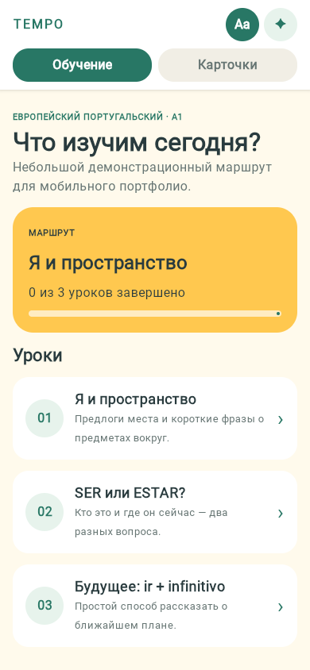
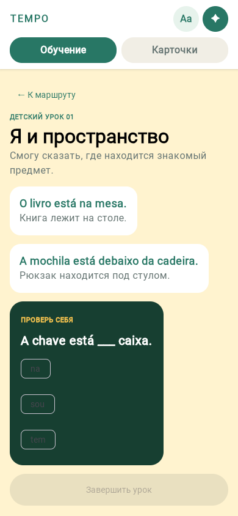
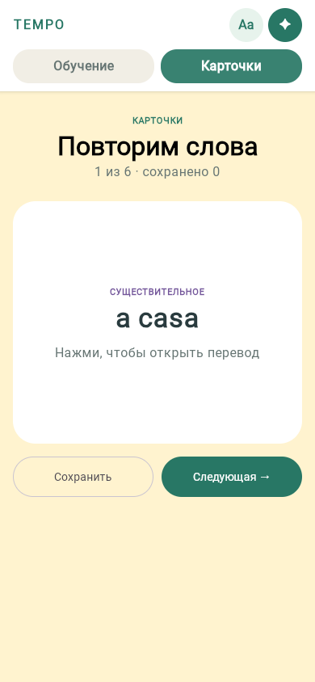

# Tempo Demo

**A mobile-first European Portuguese learning app built with Kotlin Multiplatform and shared Compose UI.**

[Open the web demo](https://tempo-kmp-demo.olga-kroha22.chatgpt.site) · Android · iOS · WebAssembly

> The hosted demo currently uses owner-only access through ChatGPT Sites. The application is a lightweight product demo: no account, backend, or personal data is included.

Tempo Demo explores how one learning experience can run across Android, iOS, and the web without duplicating product logic or interface code. It combines short guided lessons, a reusable card flow, and two visual presentations over the same language content and accepted answers.

## Preview

<p align="center">
  
  
  
</p>

<p align="center"><sub>WebAssembly build captured at 390 × 844 CSS pixels.</sub></p>

## What is included

- The first A1.1 route: six European Portuguese lessons and the “New room” checkpoint.
- Adult and child presentations backed by the same state and learning rules.
- Typed meaning, example, vocabulary, activity, and summary blocks.
- Can-Do goals, independent checks, completion results, and route progress.
- Lesson-to-card saving and a review flow with flip, save, and next actions.
- The complete built-in deck of 1,000 unique Portuguese infinitives with stable `v0001`–`v1000` IDs, frequency rank, and basic-verb marker.
- Local progress persistence on Android and iOS.
- Stable lesson and card identifiers in typed demo content.
- Shared Compose UI and a pure Kotlin state reducer.
- Thin Android, iOS, and WebAssembly hosts.

The demo deliberately excludes the Books reader, accounts, cloud progress, and the larger production curriculum.

### Native cards and words update

The shared native UI now includes 14 word themes, the 351-word collection, eight classroom instruction cards, school phrase exercises, related short lessons and present-tense forms. Compact cards use side chevrons; ratings persist locally and affect verb review intervals. Audio is intentionally omitted. See [native update details and validation](docs/native-web-parity.md).

## Architecture

```text
shared/
├── commonMain/
│   ├── model/        typed lessons, cards, state, and reducer
│   └── ui/           shared Compose screens and presentation themes
├── commonTest/       platform-independent state tests
└── iosMain/          Compose UIViewController bridge

androidApp/           Android activity host
iosApp/               SwiftUI application host
webApp/               Kotlin/Wasm browser host
```

The shared reducer is intentionally independent from UI widgets. Switching between adult and child presentations therefore keeps lesson completion, card position, revealed state, and saved-card identifiers intact.

## Platform status

| Target | Current state | Verified |
| --- | --- | --- |
| Android | Runnable Compose application using the shared UI and local progress | Previous baseline built; current lesson transfer awaiting verification |
| iOS | SwiftUI host embedding the shared Compose controller and local progress | Previous baseline built; current lesson transfer awaiting verification |
| Web | Kotlin/Wasm application using the same shared UI | Previous production bundle verified; current lesson transfer awaiting verification |

This is a functional product demo, not a store-ready release. Android and iOS keep completed lessons, results, presentation mode, and saved-card IDs locally. The web target still resets state when the page reloads. Accounts, cloud sync, signing, distribution metadata, accessibility hardening, and device-level release QA remain future work.

## Technology

- Kotlin `2.4.20`
- Compose Multiplatform `1.12.1`
- Gradle `9.6.1`
- Android Gradle Plugin `9.1.1`
- Kotlin/Wasm for the browser target
- SwiftUI as the thin iOS application shell

## Build and run

Requirements: JDK 17+, Android SDK for Android builds, and Xcode for iOS builds.

### Web

Create the production web bundle:

```bash
./gradlew :webApp:wasmJsBrowserDistribution
```

Serve the generated bundle locally from `webApp/build/dist/wasmJs/productionExecutable/` with any static HTTP server.

### Android

```bash
./gradlew :androidApp:assembleDebug
```

The debug APK is written under `androidApp/build/outputs/apk/debug/`.

### iOS

Open `iosApp/iosApp.xcodeproj` in Xcode and run the `iosApp` scheme on an Apple Silicon iOS Simulator.

### Shared tests

```bash
./gradlew :shared:iosSimulatorArm64Test
```

The common tests cover presentation-state parity, navigation, card-session wrapping, reveal reset, stable saved-card IDs, and the 1,000-verb deck contract.

## Data attribution

Verb frequency ordering is derived from Corpus do Português. Russian translations in the imported verb deck come from FreeDict `rus-por` and are distributed under [CC BY-SA 3.0](https://creativecommons.org/licenses/by-sa/3.0/). The deck is carried over from the main Tempo project without a new editorial review; frequency rank and translation remain separate fields.

## Current direction

The next product step is to validate the transferred first route on Android and iOS devices, then decide whether the demo needs cloud progress or should remain local-only. Books and the full production curriculum remain outside this repository.

---

Built as a focused cross-platform slice of the broader Tempo learning product.
